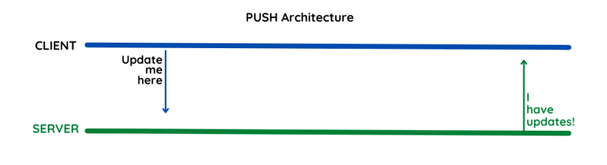

## Push APIs

This is an architecture where data is pushed upstream over a connection as soon as it becomes available. One type of push-based transport is called a websocket, which is a persistent, bidirectional connection through which both the client and the server can push data. It's one of the foundations of the real-time web, and is the technology that underpins many popular chat and other real-time platforms. Other common places people encounter push-style communication is on their phones, where special offers, notifications, and score updates are often delivered directly to their devices.

### Event driven
Event-driven architecture is common in microservices-based systems. It utilises events to trigger communication and actions across different services.

Producers, brokers, and consumers are the three key components of this design. The publishers publish an event, which the brokers then filter and push to the consumer micro-services. This architecture uses push APIs to push events from publishers to brokers, and then from brokers to consumers, triggering appropriate services.

### Pub/Sub
For asynchronous messaging, the pub/sub architecture is very popular. Pub/sub is a specific type of event-driven architecture that’s more scalable than other messaging architectures.

A publisher publishes information to a broker, and clients receive that information from the broker based on their subscriptions. Push APIs are used by the publisher to send information to the broker, who then sends the information to its subscribers.

### WebSockets
WebSockets establishes a long-lived, socket-like connection between the server and the clients, enabling them to exchange data at any moment. There are no requests or responses; messages are just pushed from one end to the other, and push APIs are at the heart of the WebSockets architecture.