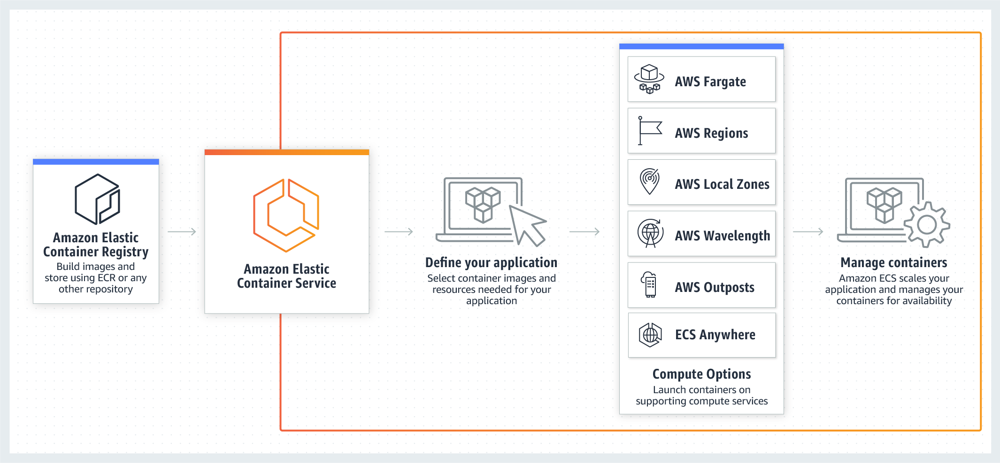

# Amazon Web Services

## Data

### Glue

> AWS Glue is a serverless data integration service that makes it easy to discover, prepare, and combine data for analytics, machine learning, and application development.

https://aws.amazon.com/glue

### Lambda

> AWS Lambda is a serverless compute service that lets you run code without provisioning or managing servers, creating workload-aware cluster scaling logic, maintaining event integrations, or managing runtimes.

https://aws.amazon.com/lambda

### Data Pipeline
> AWS Data Pipeline is a web service that helps you reliably process and move data between different AWS compute and storage services, as well as on-premises data sources, at specified intervals.

https://aws.amazon.com/datapipeline

### AWS Kinesis

> Amazon Kinesis makes it easy to collect, process, and analyze real-time, streaming data so you can get timely insights and react quickly to new information. Amazon Kinesis offers key capabilities to cost-effectively process streaming data at any scale, along with the flexibility to choose the tools that best suit the requirements of your application. With Amazon Kinesis, you can ingest real-time data such as video, audio, application logs, website clickstreams, and IoT telemetry data for machine learning, analytics, and other applications. Amazon Kinesis enables you to process and analyze data as it arrives and respond instantly instead of having to wait until all your data is collected before the processing can begin.

https://aws.amazon.com/kinesis

## Deployment

### Code Build

> AWS CodeBuild is a fully managed continuous integration service that compiles source code, runs tests, and produces ready-to-deploy software packages.

https://aws.amazon.com/codebuild

### ECR

> Amazon ECR is a fully managed container registry offering high-performance hosting, so you can reliably deploy application images and artifacts anywhere.

https://aws.amazon.com/ecr

### ECS

> Amazon ECS is a fully managed container orchestration service that makes it easy for you to deploy, manage, and scale containerized applications.

https://aws.amazon.com/ecs

### EKS

> Amazon EKS is a managed Kubernetes service to run Kubernetes in the AWS cloud and on-premises data centers. In the cloud, Amazon EKS automatically manages the availability and scalability of the Kubernetes control plane nodes responsible for scheduling containers, managing application availability, storing cluster data, and other key tasks. With Amazon EKS, you can take advantage of all the performance, scale, reliability, and availability of AWS infrastructure, as well as integrations with AWS networking and security services. On-premises, EKS provides a consistent, fully-supported Kubernetes solution with integrated tooling and simple deployment to AWS Outposts, virtual machines, or bare metal servers.

https://aws.amazon.com/eks

## Security

### IAM (Identity and Access Management)

> With AWS Identity and Access Management (IAM), you can specify who or what can access services and resources in AWS, centrally manage fine-grained permissions, and analyze access to refine permissions across AWS.

Defines the controls and polices that are used to manage access to AWS Resources. Using IAM you can create users and groups and define permissions to various DevOps services.

In addition to the users, various services may also need access to AWS resources. For example, your CodeBuild project might need access to store Docker images in Amazon Elastic Container Registry (Amazon ECR) and need permissions to write to Amazon ECR. These types of permissions are defined by a special type role know as service role.

IAM is one component of the AWS security infrastructure. With IAM, you can centrally manage groups, users, service roles and security credentials such as passwords, access keys, and permissions policies that control which AWS services and resources users can access. IAM Policy lets you define the set of permissions. This policy can then be attached to either a Role, User, or a Service to define their permission. You can also use IAM to create roles that are used widely within your desired DevOps strategy. In some cases, it can make perfect sense to programmatically AssumeRole instead of directly getting the permissions. When a service or user assumes roles, they are given temporary credentials to access a service that you normally don’t have access.

#### Policies
A policy is a collection of permissions for a specified services. For example you could have a policy that only allows some users to view the ECS tasks, but allows other users to run them.

Policies can be attached to Groups or directly to individual IAM users.

#### Groups
Groups are what they sound like: groups of users that share access policies. When you add a policy to a group, all of the members of that group acquire the permissions in the policy.

https://aws.amazon.com/iam/

### CloudWatch

Observability of your AWS resources and applications on AWS and on-premises

CloudWatch provides you with data and actionable insights to monitor your applications, respond to system-wide performance changes, and optimize resource utilization.

### GuardDuty

Intelligent threat detection

Amazon GuardDuty is a threat detection service that continuously monitors for malicious activity and unauthorized behavior to protect your AWS accounts, workloads, and data stored in Amazon S3.

### Inspector

Automate vulnerability management

Amazon Inspector is a vulnerability management service that continually scans AWS workloads for software vulnerabilities and unintended network exposure.

### Organizations

> AWS Organizations lets you create new AWS accounts at no additional charge. With accounts in an organization, you can easily allocate resources, group accounts, and apply governance policies to accounts or groups.

https://aws.amazon.com/organizations

### Secrets Manager

> AWS Secrets Manager helps you manage, retrieve, and rotate database credentials, API keys, and other secrets throughout their lifecycles.

https://aws.amazon.com/secrets-manager

### Security Hub

Automate security checks and security alerts

AWS Security Hub is a cloud security posture management service that performs security best practice checks, aggregates alerts, and enables automated remediation.

### Shield

Managed DDoS protection service
AWS Shield is a managed Distributed Denial of Service (DDoS) protection service that safeguards applications running on AWS.

### WAF

Web application firewall 	AWS WAF is a web application firewall that helps protect your web applications or APIs against common web exploits and bots that may affect availability, compromise security, or consume excessive resources. 

