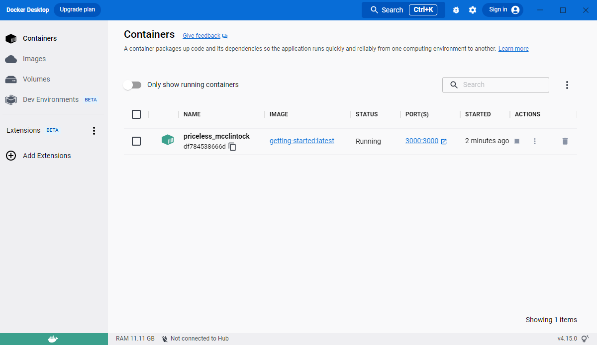

# Virtualization (Docker)

> Docker is an open platform for developing, shipping, and running applications. Docker enables you to separate your applications from your infrastructure so you can deliver software quickly. With Docker, you can manage your infrastructure in the same ways you manage your applications. By taking advantage of Docker’s methodologies for shipping, testing, and deploying code quickly, you can significantly reduce the delay between writing code and running it in production.


https://docs.docker.com/get-started/overview/

Docker has a list of advantages that makes it super useful. Some of them are:

**Isolation**
: It helps us create an environment agnostic system. Your application runs smoothly on different platforms. This is essentially achieved using containers.

**Portability**
: Since all of your dependencies are in the same container, it’s easy to carry from one place to another giving Docker its portability.

**Lightweight**
: Runs as another application on your system instead of consuming whole lot resources of your system.

**Robustness**
: Less demanding in terms of hardware and needs very little memory as compared to VMs, hence providing efficient isolation levels which help save not only the cost but also time.

## Definitions
#### The Docker daemon
The Docker daemon (dockerd) listens for Docker API requests and manages Docker objects such as images, containers, networks, and volumes. A daemon can also communicate with other daemons to manage Docker services.

#### The Docker client
The Docker client (docker) is the primary way that many Docker users interact with Docker. When you use commands such as docker run, the client sends these commands to dockerd, which carries them out. The docker command uses the Docker API. The Docker client can communicate with more than one daemon.

#### Docker Desktop
Docker Desktop is an easy-to-install application for your Mac, Windows or Linux environment that enables you to build and share containerized applications and microservices. Docker Desktop includes the Docker daemon (dockerd), the Docker client (docker), Docker Compose, Docker Content Trust, Kubernetes, and Credential Helper. For more information, see Docker Desktop.

#### Docker registries
A Docker registry stores Docker images. Docker Hub is a public registry that anyone can use, and Docker is configured to look for images on Docker Hub by default. You can even run your own private registry.

When you use the docker pull or docker run commands, the required images are pulled from your configured registry. When you use the docker push command, your image is pushed to your configured registry.

#### Docker objects
When you use Docker, you are creating and using images, containers, networks, volumes, plugins, and other objects. This section is a brief overview of some of those objects.

##### Images
An image is a read-only template with instructions for creating a Docker container. Often, an image is based on another image, with some additional customization. For example, you may build an image which is based on the ubuntu image, but installs the Apache web server and your application, as well as the configuration details needed to make your application run.

You might create your own images or you might only use those created by others and published in a registry. To build your own image, you create a Dockerfile with a simple syntax for defining the steps needed to create the image and run it. Each instruction in a Dockerfile creates a layer in the image. When you change the Dockerfile and rebuild the image, only those layers which have changed are rebuilt. This is part of what makes images so lightweight, small, and fast, when compared to other virtualization technologies.

##### Containers
A container is a runnable instance of an image. You can create, start, stop, move, or delete a container using the Docker API or CLI. You can connect a container to one or more networks, attach storage to it, or even create a new image based on its current state.

By default, a container is relatively well isolated from other containers and its host machine. You can control how isolated a container’s network, storage, or other underlying subsystems are from other containers or from the host machine.

A container is defined by its image as well as any configuration options you provide to it when you create or start it. When a container is removed, any changes to its state that are not stored in persistent storage disappear.

## Example
The following command runs an ubuntu container, attaches interactively to your local command-line session, and runs /bin/bash.

```bash
docker run -i -t ubuntu /bin/bash
```

When you run this command, the following happens (assuming you are using the default registry configuration):

If you do not have the ubuntu image locally, Docker pulls it from your configured registry, as though you had run docker pull ubuntu manually.

Docker creates a new container, as though you had run a docker container create command manually.

Docker allocates a read-write filesystem to the container, as its final layer. This allows a running container to create or modify files and directories in its local filesystem.

Docker creates a network interface to connect the container to the default network, since you did not specify any networking options. This includes assigning an IP address to the container. By default, containers can connect to external networks using the host machine’s network connection.

Docker starts the container and executes /bin/bash. Because the container is running interactively and attached to your terminal (due to the -i and -t flags), you can provide input using your keyboard while the output is logged to your terminal.

When you type exit to terminate the /bin/bash command, the container stops but is not removed. You can start it again or remove it.

#### The underlying technology
Docker is written in the Go programming language and takes advantage of several features of the Linux kernel to deliver its functionality. Docker uses a technology called namespaces to provide the isolated workspace called the container. When you run a container, Docker creates a set of namespaces for that container.

These namespaces provide a layer of isolation. Each aspect of a container runs in a separate namespace and its access is limited to that namespace.

https://docs.docker.com/get-started/overview/

## Multiple Containers
The docker command only works with one container at a time. You’ll often want to use containers in aggregate. Docker Compose is a tool that lets you define your containers declaratively in a YAML file. You can start them all up with a single command.

This is helpful when your project depends on other services, such as a web backend that relies on a database server. You can define both containers in your docker-compose.yml and benefit from streamlined management with automatic networking.

Here’s a simple docker-compose.yml file:

```yaml
version: "3"
services:
  app:
    image: app-server:latest
    ports:
      - 8000:80
  database:
    image: database-server:latest
  volumes:
    - database-data:/data
volumes:
  database-data:
```

This defines two containers (app and database). A volume is created for the database. This gets mounted to /data in the container. The app server’s port 80 is exposed as 8000 on the host. Run docker-compose up -d to spin up both services, including the network and volume.

The use of Docker Compose lets you write reusable container definitions that you can share with others. You could commit a docker-compose.yml into your version control instead of having developers memorize docker run commands.

There are other approaches to running multiple containers, too. Docker App is an emerging solution that provides another level of abstraction. Elsewhere in the ecosystem, Podman is a Docker alternative that lets you create “pods” of containers within your terminal.

## Building

In order to build the container image, you’ll need to use a Dockerfile. A Dockerfile is simply a text-based file with no file extension. A Dockerfile contains a script of instructions that Docker uses to create a container image.

```bash
# syntax=docker/dockerfile:1
FROM node:18-alpine
WORKDIR /app
COPY . .
RUN yarn install --production
CMD ["node", "src/index.js"]
EXPOSE 3000
```

Build the container image

```bash
docker build -t app-name .
```

The docker build command uses the Dockerfile to build a new container image. You might have noticed that Docker downloaded a lot of “layers”. This is because you instructed the builder that you wanted to start from the node:18-alpine image. But, since you didn’t have that on your machine, Docker needed to download the image.

After Docker downloaded the image, the instructions from the Dockerfile copied in your application and used yarn to install your application’s dependencies. The CMD directive specifies the default command to run when starting a container from this image.

Finally, the -t flag tags your image. Think of this simply as a human-readable name for the final image. Since you named the image `app-name`, you can refer to that image when you run a container.

The . at the end of the docker build command tells Docker that it should look for the Dockerfile in the current directory.

Now that you have an image, you can run the application in a container. To do so, you will use the docker run command.

Start your container using the docker run command and specify the name of the image you just created:

```bash
docker run -dp 3000:3000 app-name
```

You use the -d flag to run the new container in “detached” mode (in the background). You also use the -p flag to create a mapping between the host’s port 3000 to the container’s port 3000. Without the port mapping, you wouldn’t be able to access the application.

After a few seconds, open your web browser to http://localhost:3000. You should see your app.

## Docker Dashboard



## Deployment (Kubernetes) (Container Orchestration)

## Remove the old container
To remove a container, you first need to stop it. Once it has stopped, you can remove it. You can remove the old container using the CLI or Docker Desktop’s graphical interface. Choose the option that you’re most comfortable with.

Get the ID of the container by using the docker ps command.

```bash
docker ps
```

Use the docker stop command to stop the container. Replace <the-container-id> with the ID from docker ps.


```bash
docker stop <the-container-id>
```

Once the container has stopped, you can remove it by using the docker rm command.

```bash
docker rm <the-container-id>
```

#### Note
You can stop and remove a container in a single command by adding the force flag to the docker rm command. For example: `docker rm -f <the-container-id>`
